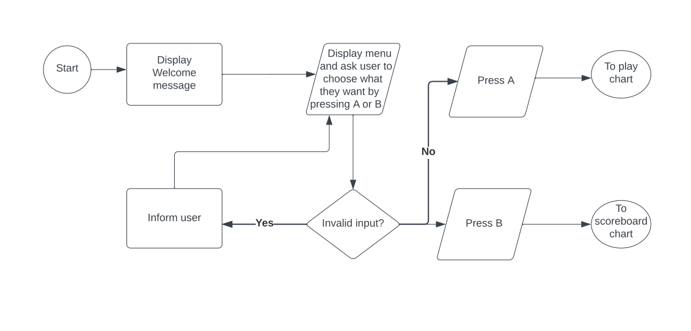
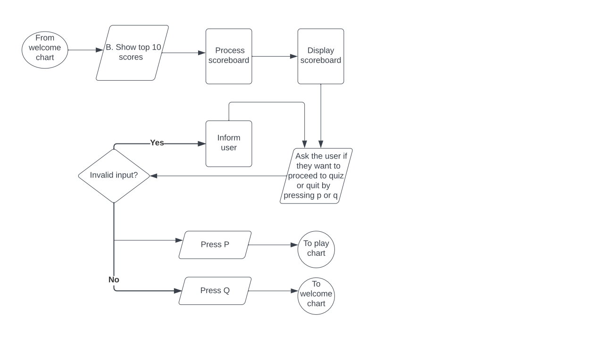
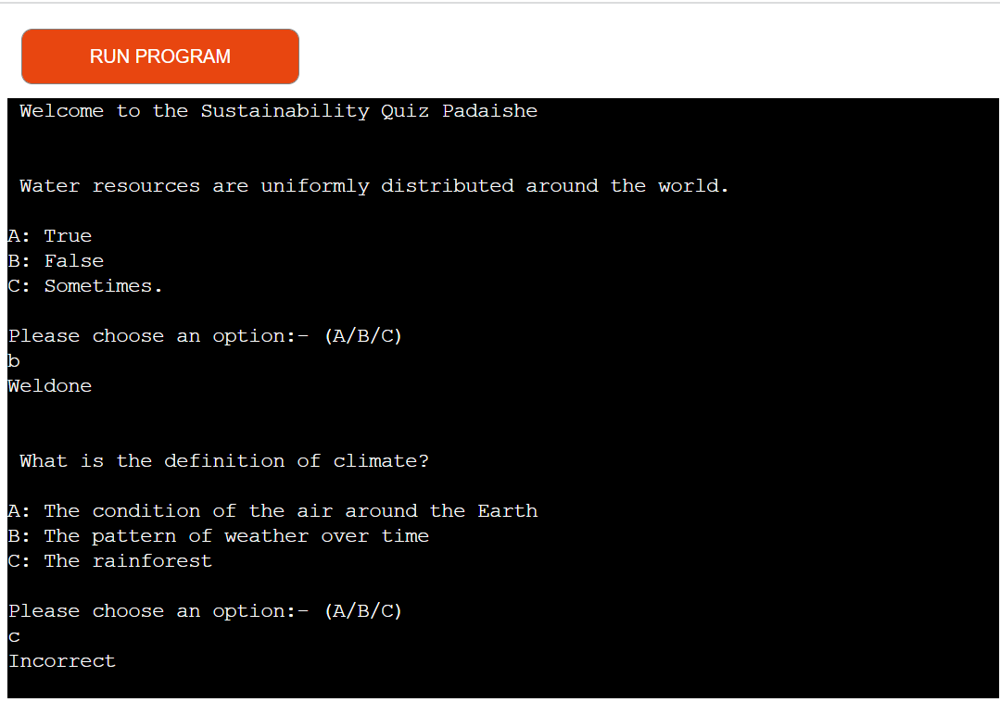
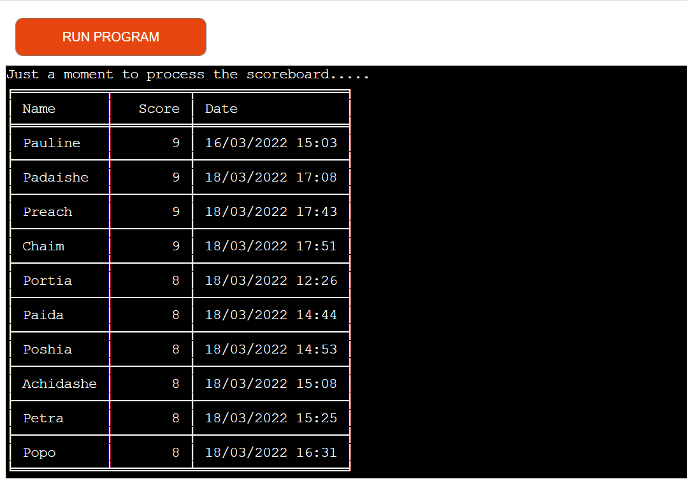
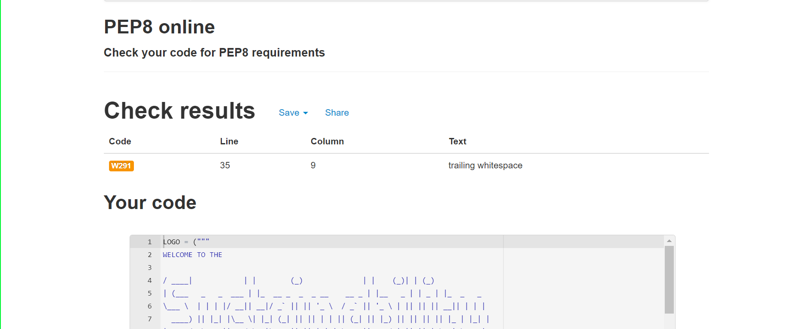

# SUSTAINABILITY QUIZ
Are you walking the talk when it comes to sustainability? Sustainability means meeting our own needs without compromising the ability of future generations to meet their own needs. In addition to natural resources, we also need social and economic resources. Sustainability is not just environmentalism. Embedded in most definitions of sustainability we also find concerns for social equity and economic development. This Sustainability quiz is a game built using python to further test the users their understanding of what sustainability is all about.

[Link to live website](https://sustainability-quiz-app.herokuapp.com/)
# UX
* The sustainability quiz is a quiz game intended for anyone who understands or willing to understand how things like global warming, enviromental issues are posing concerns to the current and future generations and how exactly businesses have to respond to address these issues so they remain sustainable. I tried to make sure the questions are short, precise and funny for the users.

## Site Goals
- To educate users about sustainability through a funny quiz
- To provide users with a range of randomised questions each time they play
- To provide users ability to see how they perfomed

## User Stories
### New user
- As a new user, I want to understand more about sustainability
- As a new user, I want to compare my knowledgge against other users
- As a new user, I want to play a unique quiz game

### Returning user
- Users will be looking to see if any additional functionality has been added

# Logic flow
### Game start

### Play Chart

### Scoreboard

# Features
### Welcome screen
As the quiz loads, users are first welcomed by the welcoming logo that tells the type of questions they are to play and asked what they want to do.

### Instructions screen
Assuming the user chooses the Play option, this takes them first to the introductory message followed by the rules of the game. They are then asked to enter their name.

### Question screen
User is immediately welcomed by their name and the first question appears. The questions are in multiple choice form, each question is presented to the user with 3 choices to choose from. A weldone feedback message appears soon after a correct answer is chosen before a new question is presented. An incorrect feedback message appears soon after a wrong answer is chosen before a new question is presented.

### End of quiz screen
A thank you message to the user is displayed with their name. Their score is also displayed and the scoreboard is updated before the gameover logo is displayed. User is given choices to take, either replaying the quiz, showing the scoreboard or quit the quiz

If the user chooses to replay the quiz by pressing P, they are taken to the instruction screen that will take them to the questions screen.

If the user chooses to click the Run program button, they are taken to the welcome screen.

If the user chooses to view the scoreboard by pressing S, they are taken to the scoreboard screen which is show below.

### Show top 10 Scores/View scoreboard screen
This is the second choice shown to the user at the beginning of the game or at the welcome screen. It is also the screen that shows when the user press S on the end of quiz screen. It shows the sustainability quiz top ten scores. The name of the player, the score, and the date they played. After the user has viewed the scored, they have the choice to proceed to play the quiz or quit by pressing P and Q respectively. P takes them to the quiz instructions then to the quiz, Q takes them to the welcome screen.

## Technology used
- Python - the language in which the game is written
- Github - version control
- Heroku - platform which the game was deployed
- Lucid app - flow charts
- [ASCII art](http://patorjk.com/software/taag/#p=testall&h=1&f=Rounded&t=gameover)- to create gameover and logo art image

# Testing
Firstly conntiuos testing during app development was implemented. Writing individual functions and testing them using print statements to ensure intended results were obtained. I tested from when the game begins, where the menu is displayed, testing if correct inputs were being entered. In this case if the input is not valid the user is asked again to put a valid input before they can continue. 

When the user views the scoreboard, I tested to ensure only the valid keypresses are accepted for users to either play or quit the game. Same applies to questions, I tested to ensure questions are displayed randomly, correct feedback given depending on answer, also valid answers to be provide else user will be asked to enter a valid input before they can continue.

When the game ends, user is given choices to replay, view scoreboard or quit by pressing keys 'p', 's'. and click run program button respectively. Every other keypress will be an invalid input. All this was tested inorder to get intended results. Finally I was checking the code so often with the [PEP8 checker](http://www.pep8online.com/) as I was still wrapping my head around python. I wanted to make sure my code was fine before adding more and more functionality.

### Bugs
- In trying to validate the user name, I first used if statements which would run only once, the next input a user makes would then be accepted as a valid user name which is something I did not want. I wanted only letters from 'a' to 'z' for the name to be valid. To correct this, a while loop was used instead.
- After deploying to heroku, I had a situation whereby if a user plays the game and gets a very high, when I choose to view the scoreboard when the game ends the score would not appear at the scoreboard unless only the whole app is refreshed. To correct this, only one line of code was needed which I did not utilise earlier. I had to use the get_all_values() gspread method.

### Validator testing
- run.py

- constants.py

The python file has no errors reported, however the constants file has one trailing white space caused by the ASCII art, something that adds some wow effect to the game.

# Deployment

My game was deployed via Heroku as follows:
- Sign in to Heroku
- Select New and Create New App
- For app name, I put sustainability-quiz-app and chose Europe for region then create app
- Select the created app from the dashboard and navigate to Settings
- Scroll down to config vars and click reveal config vars, I set two Config Vars, one is CREDS.json file, and the other is to set the PORT to 8000
- Scroll down and buildpack button. Select python as the first buildpack and node.js as the second
- Navigate to Deploy tab at the top of the page
- For the deployment method, select Github. If access hasn't already been configured, do this from Account settings > Applications > Third-party Services.
- Enter the repository name, I put sustainability-quiz-app and selected search then click connect
- Confirm the correct branch and choose either to automatically or manually deploy your app. In this case I manually deployed so I clicked manual deploy.
- The build process will begin and a message "Your app was successfully deployed" will appear and a link to the live site

# Credit
## Content
The following sites were used for the quiz questions:

- https://assets.new.siemens.com/siemens/assets/api/uuid:51501a0c-4856-4f7e-a84f-d313b9781067/5-2-sustainability-quiz-answers.pdf

- https://www.theguardian.com/global/2017/jul/30/lucy-siegle-great-green-quiz

- https://www.yeovalley.co.uk/sustainability-quiz/

- https://mcqslearn.com/o-level/environmental-management/environmental-sustainability-mcqs.php

- https://www.mcgill.ca/sustainability/files/sustainability/what-is-sustainability.pdf

## Code
The time this python module came by, I was still wrapping around my mind with Javascript and jumping from it to python gave me some hard time. I went through various blogs and tutorials just to understand a few concepts before embarking on this project. Most stuff was too complicated for a python newbie however there is my favourite web development and python youtuber who made me understand what I wanted to do in a matter of a few minutes, thanks to [Giraffe Academy](https://www.youtube.com/watch?v=SgQhwtIoQ7o&list=LL&index=6&t=160s) with Mike Dane. 

The code to validate the user input name is from [Stackoverflow](https://stackoverflow.com/questions/36432954/python-validation-to-ensure-input-only-contains-characters-a-z). At first I used the if else statements however the second time a user entered an invalid input it would pass through which was not ideal.

To understand the gspread, first had to go through Code Institute's love sandwiches tutorial twice then went through [gspread](https://docs.gspread.org/en/latest/) documentation to get a full grasp.

## Acknowledgements
- Love sandwiches tutorial
- If there is one thing Code Institute has done best for its students, is its slack community
- My mentor